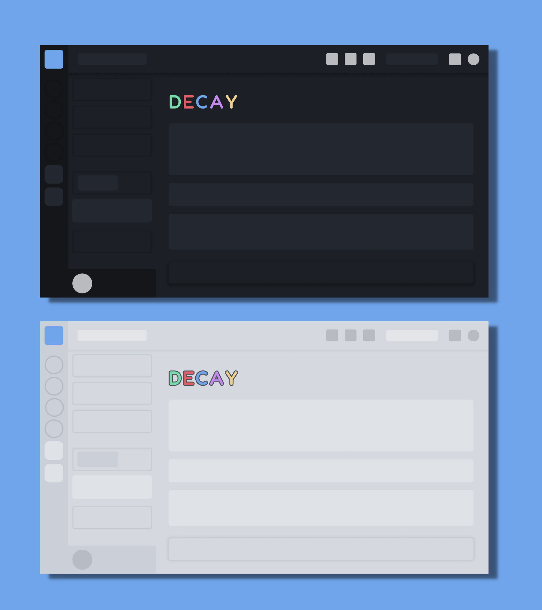
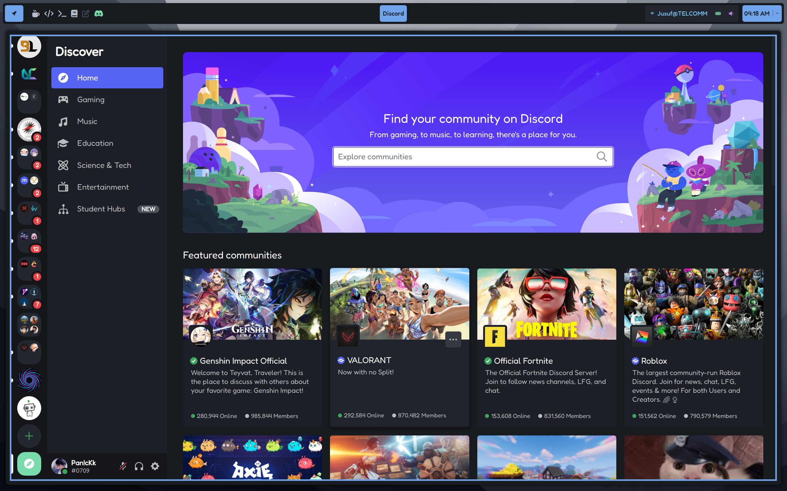
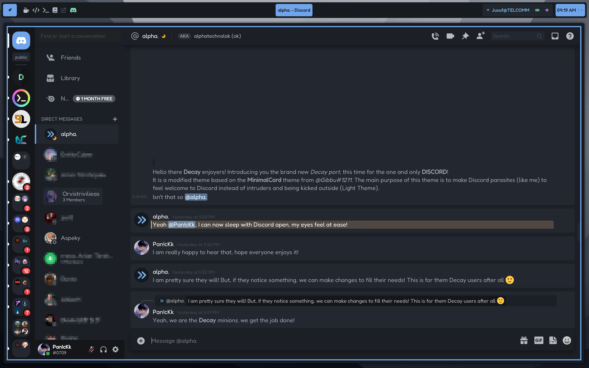
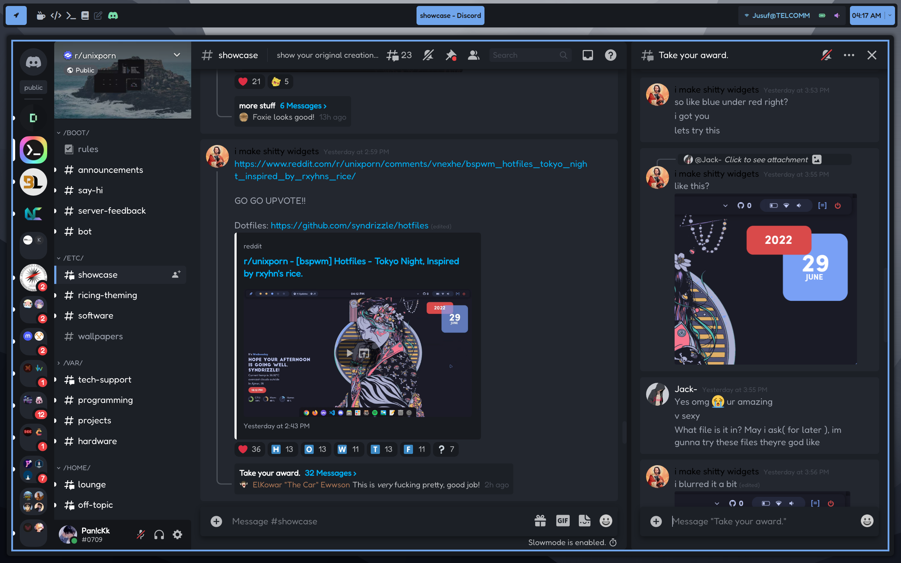
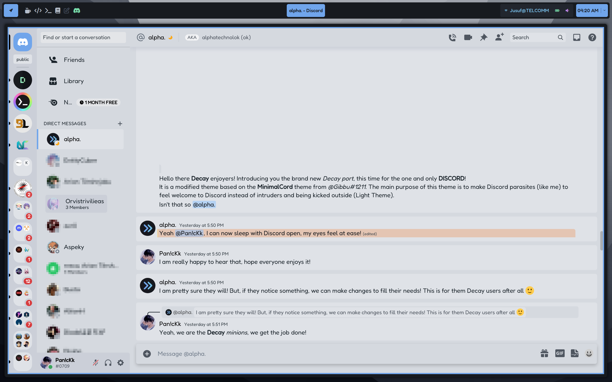
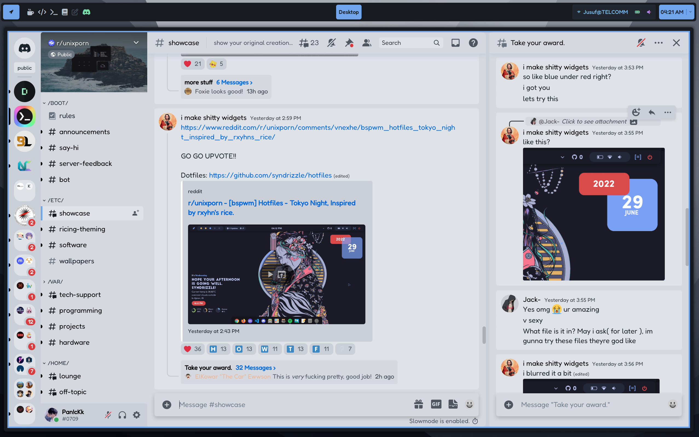

# :last_quarter_moon: <h1 align="center">Decay port for Discord</h1>


Makes Discord comfortable for any type of users, the cavemans and those that love going out and enjoy the sun!

## Setup

```sh
git clone https://github.com/decaycs/decay-discord.git
```

To be able to use the Decay Discord Theme, you need to have one of the "projects" below:

| Project | Source |
| ----------- | ----------- |
| BetterDisocrd | [BD](https://betterdiscord.app/) |
| PowerCord | [PC](https://powercord.dev/) |

After you setup your prefered "project", all you have to do is:
`cp /path/to/decay-discord/Decay.theme.css /path/to/project/themes_directory`

## Origin
This theme was inspired and is based on [MinimalCord](https://github.com/DiscordStyles/MinimalCord/) but a modified version of it, to match the needs of an eye at peace and match the Decay structure.

## Table of Credits
| Source | Motivated |
| ----------- | ----------- |
| [MinimalCord](https://betterdiscord.app/theme/MinimalCord) | The Decay Discord Theme itself |
| [Zelk](https://betterdiscord.app/theme/Zelk) | The Design of the [Showcase Images](#Decay-port-for-Discord) |

### Real use of Decay Discord theme

<details>
  <summary>Dark Theme</summary>
  
  
  
  
</details>

<details>
  <summary>Light Theme</summary>
  
  
  
  
</details>


> Make sure to leave a comment if you notice any issues or have an idea for improvement!... aaannd I believe you know what to do?! **SMASH THAT STAR**
